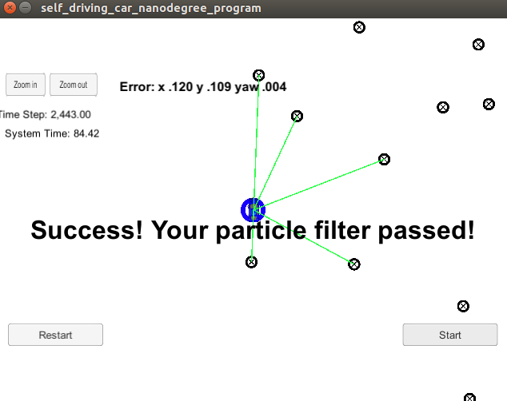

# Particle Filter Project
Self-Driving Car Engineer Nanodegree Program

This project implements a particle filter as part of the localization module in the Udacity Nanodegree program. The rubric for passing is if the particle filter localizes the vehicle to the desired accuracy within 100 seconds, and is checked automatically by running the run.sh script.

Below is a screenshot of the final fun

